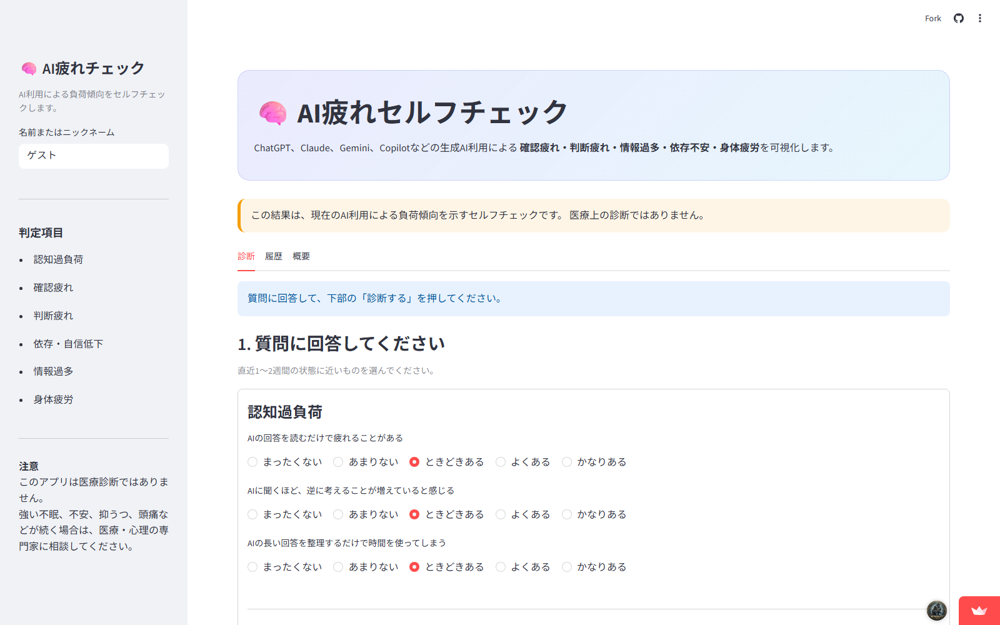
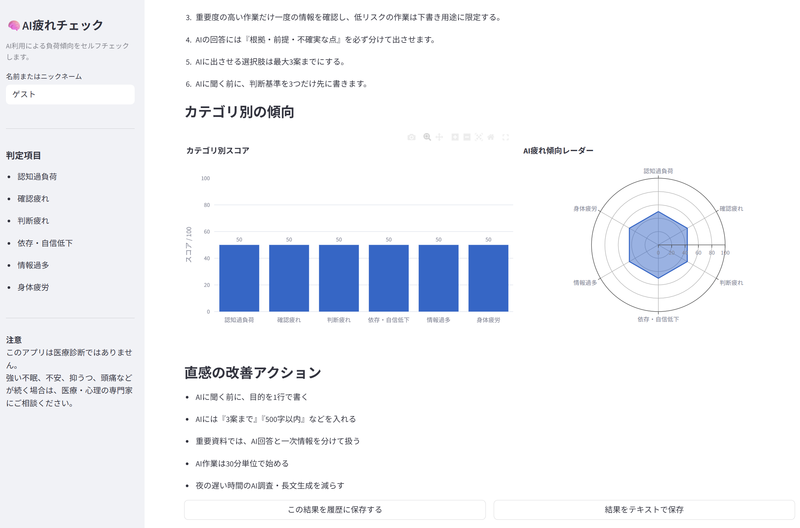

# AI疲れセルフチェック

生成AI利用による「確認疲れ」「判断疲れ」「情報過多」「依存不安」「身体疲労」を可視化するセルフチェックアプリです。

## Demo

公開アプリはこちらです。

https://ai-fatigue-checker-sbc.streamlit.app/

## 画面イメージ

### 質問画面



### 結果画面



## 概要

ChatGPT、Claude、Gemini、Copilotなどの生成AIは業務効率を高めますが、使い方によっては以下のような負荷が増えることがあります。

- AIの回答を確認する疲れ
- 回答案が増えすぎることによる判断疲れ
- 新しいAIツールや情報を追い続ける疲れ
- AIなしで考えることへの不安
- 長時間作業による目・肩・頭の疲労

本アプリは、それらを数分でセルフチェックし、タイプ別の改善アクションを提示します。

## 主な機能

- 16問のAI疲れセルフチェック
- 0〜100点のAI疲れ度スコア
- 6カテゴリ別スコア
- 主な疲労タイプ判定
- タイプ別改善提案
- 個人向けAI利用ルール生成
- 履歴保存
- グラフ表示
- 結果テキスト出力
- 履歴CSV出力

## 起動方法

```bash
pip install -r requirements.txt
streamlit run app.py
```

## テスト

```bash
pytest
```

## ファイル構成

```text
ai_fatigue_checker/
├─ app.py
├─ questions.py
├─ scoring.py
├─ recommendations.py
├─ requirements.txt
├─ README.md
└─ data/
   └─ history.csv  # 初回起動時に自動作成
```

## Current Limitations

- 履歴保存はローカルCSVを利用しています。
- Streamlit Community Cloud上では、ローカルファイルの永続保存を前提としていません。
- 本格運用では Supabase / Google Sheets / PostgreSQL などの外部ストレージ連携が必要です。

## Roadmap

- スマホ表示の最適化
- 診断結果コメントの改善
- Googleフォームなどによるフィードバック収集
- Supabase連携による履歴永続化
- チーム診断版の設計
- PDFレポート出力

詳細な改善予定は [docs/roadmap.md](docs/roadmap.md) を参照してください。

## 注意事項

このアプリは医療診断ではありません。  
強い不眠、不安、抑うつ、頭痛などが続く場合は、医療・心理の専門家に相談してください。
